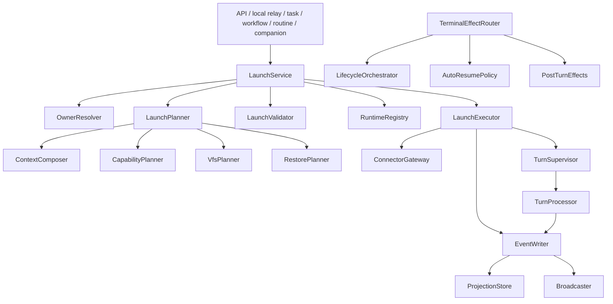
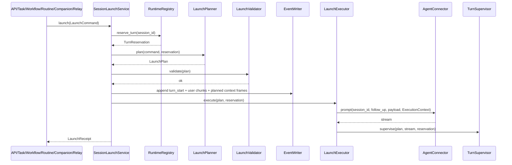

# AgentDash Session 与拉起流程定向 Review / 系统性重构规划

> 审查对象：`AgentDash.zip` 解压后的源码目录 `/mnt/data/AgentDash_extracted`  
> 审查方式：静态源码与结构审查。当前环境缺少 `cargo` / `rustc`，因此未声明通过编译、单测或集成测试。  
> 本报告是上一份全局 Review 的补充，专门聚焦 `session`、外围 owner/task/workflow/routine/companion/local relay 结构，以及 prompt 拉起流程。

---

## 1. 结论摘要

当前 session 子系统已经有明显的“收敛重构”痕迹：`SessionLaunchIntent`、`SessionRequestAssembler`、`PreparedSessionInputs`、`TurnState`、`SessionTurnProcessor` 等都在尝试把旧的多入口逻辑集中。但整体仍停留在**半收敛状态**：入口名义统一，实际组装、生命周期判断、上下文恢复、owner 绑定解析、VFS/Capability/MCP 选择、终态副作用仍分散在 API route、task service、workflow orchestrator、routine executor、companion tools、local relay 与 `SessionHub` 内部。

最核心的问题不是某个函数过长，而是**缺少一个显式、不可变、可审计的 `LaunchPlan`**。现在的拉起流程是：调用方先部分组装 `PromptSessionRequest`，再经过 `augment` 或直接 `finalize_request`，最后 `start_prompt_with_follow_up` 在内部继续做大量 fallback、状态变更和副作用。这导致状态分支多、隐形行为多、重复抽象多，且上下文查询路径与实际启动路径容易漂移。

建议把 session 拉起体系重构为一个明确的四段式架构：

```text
LaunchCommand  →  LaunchPlanner  →  LaunchPlan  →  LaunchExecutor / TurnSupervisor
入口命令          纯规划与校验          不可变执行计划      副作用执行与运行态监督
```

目标是让所有启动来源，包括 HTTP、Task、Workflow node、Routine、Companion、Hook auto-resume、Local relay，都只进入一个 `SessionLaunchService::launch(command)`。`SessionHub` 最终应退化为兼容门面或拆除，核心能力下沉到高内聚模块：`session-core`、`session-launch`、`session-runtime`、`session-context`、`session-eventing`、`session-hooks`、`session-ownership`。

---

## 2. 当前架构还原

### 2.1 Session 域对象与持久化

当前 session 的持久化核心是 `SessionMeta` 与事件流：

- `SessionMeta` 定义在 `crates/agentdash-application/src/session/types.rs`，字段包含标题、执行状态、executor config、executor follow-up session id、companion context、visible canvas mounts、`bootstrap_state`、`pending_capability_state_transitions` 等。
- `SessionPersistence` 定义在 `crates/agentdash-application/src/session/persistence.rs`，同时负责 session meta CRUD、事件 append、backlog/page/list_all_events。
- Postgres / SQLite repository 通过 `append_event` 推进 `last_event_seq`，并用 `save_session_meta` 回写 meta。代码注释已经明确指出，投影字段有 DB 侧保护，但 `executor_session_id` / `companion_context` 等非投影字段会被整行回写覆盖。

现状判断：

- `SessionMeta` 同时承载“用户可见元数据”“执行状态投影”“owner bootstrap 状态”“runtime pending 队列”“companion 子任务状态”，职责过宽。
- `pending_capability_state_transitions` 放在 meta 内，下一轮 prompt 隐式消费并清空。这是一种隐藏命令队列，不利于审计、并发和重放。
- `save_session_meta` 是整行写模型，即使已有投影保护，也会让非投影字段竞争写入的语义变复杂。

### 2.2 In-memory runtime

运行态集中在 `SessionHub.sessions: HashMap<String, SessionRuntime>`：

- `SessionRuntime` 保存 broadcast sender、hook runtime、`TurnState`、`SessionProfile`、auto-resume 计数、last activity。
- `TurnState` 已经从过去的 bool/Option 收敛为 `Idle / Claimed / Active`，这是好的方向。
- `TurnExecution` 保存 turn id、session frame、capability state、runtime injection fragments、audit ids、cancel flag、processor tx。

现状判断：

- runtime 状态与 `SessionHub` 强绑定，导致任何需要运行态的模块都倾向直接依赖 `SessionHub`。
- `SessionProfile` 目前主要缓存 `CapabilityState`，但 executor config、working dir、hook policy、restore policy 等继续散落在请求、meta、runtime 和 pipeline 中。
- processor 的 JoinHandle 被 `SessionTurnProcessor` 私有保存，但 `SessionRuntime` 只保存 `processor_tx`，缺少显式 supervisor 语义，无法统一管理 adapter task、processor task、取消 token 和异常退出。

### 2.3 请求组装与启动意图

当前有三层相关结构：

1. `UserPromptInput`：HTTP / local relay 等入口的纯用户输入。
2. `PromptSessionRequest`：用户输入 + 后端注入字段，包括 mcp、vfs、capability、context bundle、hook reload、identity、post turn handler。
3. `PreparedSessionInputs`：`SessionRequestAssembler` 的平坦输出，通过 `finalize_request` 合并进 `PromptSessionRequest`。

`SessionLaunchIntent` 定义了来源、strictness、preparation 和 follow-up，但它只表达“是否需要 augment / 是否预组装”，并没有承载完整策略。实际的 owner、lifecycle、restore、context、capability、VFS 策略仍由多个调用点决定。

现状判断：

- `SessionLaunchIntent` 是一个过渡层，不是完整 launch policy。
- `PromptSessionRequest` 被当成“半成品计划对象”反复 mutation，边界不清。
- `PreparedSessionInputs`、`SessionBootstrapPlan`、`SessionContextSnapshot`、`ExecutionContext`、`SessionProfile` 之间有明显语义重叠：都是“本 session/turn 要使用什么上下文、能力、VFS、MCP、身份”的不同投影。

### 2.4 当前拉起入口

当前所有启动路径最终进入 `SessionHub`，但前置组装分散：

| 来源 | 当前入口 | 组装位置 | 最终进入 |
|---|---|---|---|
| HTTP `/sessions/{id}/prompt` | `api/routes/acp_sessions.rs` | `augment_prompt_request_for_owner`，再按 Task/Story/Project 分支组装 | `launch_http_prompt` |
| Task step | `task/service.rs` | `compose_story_step` + `finalize_request`，注入 task post-turn handler | `launch_task_prompt` |
| Workflow AgentNode | `workflow/orchestrator.rs` | `compose_lifecycle_node_with_audit` + `finalize_request` | `launch_workflow_prompt` |
| Routine | `routine/executor.rs` | routine 内部选择 session strategy，再 `compose_owner_bootstrap` | `launch_routine_prompt` |
| Companion dispatch | `companion/tools.rs` | companion slice / workflow setup / companion context 写入 | `launch_companion_dispatch_prompt_with_follow_up` |
| Companion parent resume | `companion/tools.rs` | 构造 bare request，strict augment | `launch_companion_parent_resume_prompt` |
| Hook auto-resume | `hub/hook_dispatch.rs` | 构造 bare request，strict augment | `launch_hook_auto_resume_prompt` |
| Local relay | `agentdash-local/src/handlers/prompt.rs` | 本地 workspace vfs + request mcp + follow-up | `launch_local_relay_prompt_with_follow_up` |

现状判断：

- 名义上已经有 `launch_prompt_with_intent`，但它只做 augment/preassembled 分发，无法阻止调用方继续在外部做复杂组装。
- Task、Routine、Workflow、Companion 仍然能直接构造 `PromptSessionRequest` 和 `PreparedSessionInputs`。
- Owner prompt 的主通道在 API route 内部包含大量 application 逻辑，route 不是薄控制器。

### 2.5 `start_prompt_with_follow_up` 当前职责

`crates/agentdash-application/src/session/prompt_pipeline.rs` 的 `start_prompt_with_follow_up` 是当前事实上的核心 pipeline。它至少承担以下职责：

1. 解析用户 prompt payload。
2. 生成 turn id。
3. 通过 connector 判断是否有 live executor session。
4. 在内存 runtime 里 claim turn。
5. 读取并修改 session meta。
6. 消费 pending capability transitions。
7. 解析 VFS fallback：request → cached session profile → hub default。
8. 解析 working dir。
9. 解析 executor config fallback：request → meta。
10. 解析 hook runtime：reload / refresh / none。
11. 合并 hook snapshot contribution 到 context bundle。
12. 判断 session lifecycle：owner bootstrap / repository rehydrate / plain。
13. 构建 restored session state。
14. 扫描 skill / guideline。
15. 解析 MCP fallback：request → cached capability → pending capability。
16. 构造 capability state。
17. 构造 `ExecutionSessionFrame` / `ExecutionTurnFrame` / `ExecutionContext`。
18. 预构建 runtime tools。
19. 构造 identity frame、assignment frame、pending action frame、continuation frame。
20. 写入 runtime `SessionProfile` 与 `TurnState::Active`。
21. 提前保存 session meta 为 Running / Bootstrapped。
22. 持久化 user message chunks 和 turn_started。
23. 触发 SessionStart hook。
24. 发送 context frames。
25. 调 connector.prompt。
26. 启动 `SessionTurnProcessor`。
27. 启动 stream adapter。
28. 注册 processor tx。

现状判断：

- 该函数是典型“神级 pipeline”。职责多本身不是唯一问题，更关键的是它同时做**规划、校验、状态变更、副作用执行和运行态监督**。
- fallback 顺序写在函数内部，调用方无法看到最终生效的 VFS、MCP、capability、working dir、restore policy。
- 当前在 connector.prompt 成功前已经调用 `apply_turn_start_meta`，会把 `bootstrap_state` 从 Pending 改为 Bootstrapped，并把状态标为 Running。connector.prompt 失败时会写 failed terminal，但“bootstrap 是否真正完成”的语义已经提前发生。
- pending transitions 通过 `std::mem::take` 从本地 meta 变量取出，然后 `save_session_meta` 间接清空，这个行为隐藏在 turn start 中。

---

## 3. 主要问题清单

### 3.1 `SessionHub` 职责过宽

`SessionHub` 目前同时负责：

- session CRUD、meta 更新、事件持久化、事件广播；
- prompt launch routing、augment、low-level prompt pipeline；
- hook runtime rebuild、hook trace、hook injection sink；
- capability runtime 热更新、pending transition 队列；
- MCP runtime list/call、tool builder；
- cancel、stall 查询、companion wait registry；
- terminal callback、auto-resume、compaction enrichment；
- title generation、skill/guideline discovery。

这让 `SessionHub` 成为跨域服务定位器。外围模块依赖 `SessionHub` 后，很难只使用某一项能力，最终形成高耦合。

### 3.2 启动流程没有显式 `LaunchPlan`

现在实际执行配置分布在：

- `PromptSessionRequest`
- `PreparedSessionInputs`
- `SessionMeta`
- `SessionProfile`
- `ExecutionContext`
- `HookSnapshotReloadTrigger`
- `SessionPromptLifecycle`
- `OwnerPromptLifecycle`
- connector live session
- pending capability transitions

最终发给 connector 的结果只有在 `start_prompt_with_follow_up` 执行到中后段才确定。缺少一个“已经解析完所有 fallback 与 policy 的、不可变的、可打印/可测试的计划对象”。

### 3.3 Lifecycle 状态轴过多

当前相关状态至少包括：

- `SessionBootstrapState::{Plain, Pending, Bootstrapped}`
- `SessionPromptLifecycle::{Plain, OwnerBootstrap, RepositoryRehydrate}`
- `OwnerPromptLifecycle::{Plain, OwnerBootstrap, RepositoryRehydrate}`
- `HookSnapshotReloadTrigger::{None, Reload}`
- `ExecutionStatus::{Idle, Running, Completed, Failed, Interrupted}`
- `TurnState::{Idle, Claimed, Active}`
- connector live session / executor follow-up session id
- lifecycle run active node / pending capability transitions

这些状态本身并不都应该合并，但它们的关系需要一个清晰的状态表。现在状态转换散落在 API augment、assembler、prompt pipeline、turn processor、workflow orchestrator 中，导致隐性分支多。

### 3.4 Owner binding 解析语义不一致

`augment_prompt_request_for_owner` 中 owner 优先级是 Task → Story → Project；但 `get_session_context` 的 `pick_primary_session_binding` 是 Project → Story → Task。这会导致同一个 session 在“启动时”和“查询上下文时”使用不同 owner 解释。

建议把 owner 解析收敛到一个 `SessionOwnerResolver`，所有启动、查询、权限展示都用同一套规则。若确实存在“启动主 owner”和“展示主 owner”两个语义，也必须显式命名为不同 resolver，而不是散落在 route 内。

### 3.5 finalizer 重复，合并语义漂移

当前至少有两套 request 合并逻辑：

- `session/assembler.rs::finalize_request`
- `api/routes/acp_sessions.rs::finalize_augmented_request`

它们的 VFS 覆盖语义不同：`finalize_request` 在 prepared.vfs 存在时覆盖；`finalize_augmented_request` 会先 apply workspace defaults，且仅在 `req.vfs.is_none()` 时填入 vfs。Task owner path 又在生命周期分支里手动处理 context_bundle、continuation frame、hook reload。

这类重复会导致入口之间逐步漂移，是后续 bug 的高发区。

### 3.6 查询路径与启动路径重复组装

`/sessions/{id}/context`、project sessions、story sessions 会重新构造 VFS、capability、workflow context、snapshot。实际启动时又通过 assembler / prompt pipeline 组装一次。二者都带有“与实际 session 创建保持一致”的注释，但没有共享同一个计划对象或 composer 输出。

这说明代码已经意识到漂移风险，但尚未从架构上消除。

### 3.7 AppState 中存在隐式初始化顺序和循环依赖

`AppState` 构造中先创建 `SessionHub`，再注入 terminal callback，再构造 runtime gateway、boot reconcile、audit bus、story step activation service，最后再注入 prompt augmenter。`factory.rs` 注释也说明延迟注入用于解决循环依赖。

问题不在于延迟注入本身，而在于它没有被“ready state”类型化：

- `prompt_augmenter` 在生产环境是 strict launch 的必要依赖，但构造期间它可以为空。
- `context_audit_bus` 也在较晚阶段注入。
- clone 出去的 hub 会在注入后生效，这依赖共享 RwLock 的隐性行为。

建议引入 `SessionRuntimeContainerBuilder` / `SessionServicesBuilder`，只有 `build_ready()` 后才能暴露给 API 和后台任务。

### 3.8 Terminal 副作用集中在 TurnProcessor 内

`SessionTurnProcessor` 负责 notification persist，也负责 terminal hook、post-turn effect、auto-resume 检测、runtime 置 Idle、terminal callback。这样 processor 同时承担事件 reducer 和平台 orchestrator 的职责。

建议让 processor 只做：

```text
stream event → domain event / persisted event → terminal event
```

终态副作用通过 `TerminalEffectRouter` 订阅 terminal domain event，再分别触发 lifecycle orchestrator、task post-turn handler、hook auto-resume、companion continuation。这样可以减少 processor 的状态分支，也方便测试每个副作用。

### 3.9 working_dir 路径策略仍不安全

`path_policy.rs::resolve_working_dir` 注释明确写明当前保留绝对路径与 `..` 语义：非空输入直接 `mount_root.join(rel)`。这属于 P0 安全问题，也会让 session 的执行路径与 VFS root 语义不一致。

建议把 working dir 改为类型化：

```rust
pub struct SessionWorkingDir {
    pub mount_id: MountId,
    pub root_ref: VfsRootRef,
    pub relative: NormalizedRelativePath,
}
```

所有入口只能传 relative path，拒绝绝对路径、`..`、空白异常和路径分隔符绕过。

### 3.10 Hidden fallback 过多

典型 fallback 包括：

- VFS：request → cached session profile → hub default。
- MCP：request → cached capability → pending capability。
- capability：request → cached capability → default，再叠 pending。
- executor config：request → meta。
- follow-up：explicit follow-up → meta.executor_session_id。
- hook runtime：owner bootstrap 或 runtime missing 则 reload，否则 refresh。
- context bundle：request bundle → hook snapshot fragments。

这些 fallback 应该在 `LaunchPlanner` 中显式变成 `PlanResolutionTrace`，例如：

```rust
resolved.vfs.source = VfsSource::Request | CachedSessionProfile | HubDefault | PendingTransition;
resolved.executor.source = ExecutorConfigSource::Request | SessionMeta;
resolved.restore.source = RestoreSource::ExecutorFollowUp | RepositoryTranscript | None;
```

否则排查“为什么这次 prompt 用了这个工具/路径/上下文”会非常困难。

---

## 4. 目标架构设计

### 4.1 目标模块结构

建议先在 `crates/agentdash-application/src/session/` 内部按模块拆分，不急于新建 crate。稳定后再考虑拆 crate。

```text
session/
  core/
    ids.rs
    state.rs
    meta.rs
    events.rs
    errors.rs
  ownership/
    owner_ref.rs
    resolver.rs
    binding_service.rs
  launch/
    command.rs
    intent.rs             # 替代/扩展当前 launch_intent.rs
    policy.rs
    plan.rs
    planner.rs
    validator.rs
    executor.rs
    service.rs
  composition/
    owner.rs
    task_step.rs
    workflow_node.rs
    companion.rs
    routine.rs
    context_plan.rs
    capability_plan.rs
    vfs_plan.rs
  runtime/
    registry.rs
    turn_guard.rs
    supervisor.rs
    processor.rs
    stream_adapter.rs
    hook_runtime_store.rs
    capability_cache.rs
  context/
    composer.rs
    snapshot.rs
    frames.rs
    audit.rs
  eventing/
    writer.rs
    broadcaster.rs
    projection.rs
  hooks/
    session_hooks.rs
    auto_resume.rs
    effect_dispatcher.rs
  path/
    working_dir.rs
    normalized_path.rs
```

高层依赖方向：



### 4.2 核心设计原则

1. **单入口启动**：所有来源都进入 `SessionLaunchService::launch(command)`。
2. **规划与执行分离**：Planner 只读数据并输出 plan；Executor 只执行 plan。
3. **不可变计划**：`LaunchPlan` 一旦生成，不再通过 mutable request 继续补字段。
4. **显式 fallback**：所有 fallback 都记录来源，不在 executor 内临时 `or_else`。
5. **owner 解析唯一化**：owner/binding 的主语义由 `SessionOwnerResolver` 统一。
6. **runtime 独立**：运行态注册、turn claim、task supervision 不依赖 project/story/task repos。
7. **context 单源**：启动上下文与查询上下文来自同一个 `ContextComposer` / `ContextPlan`。
8. **终态副作用事件化**：processor 不直接做平台编排，交由 terminal effect router。
9. **路径类型化**：working dir 与 VFS path 不再是裸 `String`。
10. **薄 API**：route 只做 auth、DTO 转换、调用 use case。

### 4.3 新的核心数据结构

#### LaunchCommand

`LaunchCommand` 是所有入口传入的唯一命令对象。

```rust
pub struct LaunchCommand {
    pub session_id: SessionId,
    pub source: LaunchSource,
    pub user_input: UserPromptInput,
    pub identity: Option<AuthIdentity>,
    pub explicit_follow_up: Option<ExecutorSessionId>,
    pub owner_hint: Option<OwnerRef>,
    pub overrides: LaunchOverrides,
    pub post_turn_handler: Option<DynPostTurnHandler>,
}

pub enum LaunchSource {
    HttpPrompt,
    HookAutoResume,
    CompanionDispatch { parent_session_id: SessionId, dispatch_id: String },
    CompanionParentResume { child_session_id: SessionId, dispatch_id: String },
    TaskStep { task_id: Uuid, phase: TaskStepPhase },
    WorkflowNode { run_id: Uuid, step_key: String },
    Routine { routine_id: Uuid, execution_id: Uuid },
    LocalRelay { workspace_root: LocalWorkspaceRoot },
}
```

这里的 `LaunchSource` 不再只是诊断标签，而是完整 policy 的选择键。

#### LaunchPlan

`LaunchPlan` 是所有隐性行为显性化后的结果。

```rust
pub struct LaunchPlan {
    pub session_id: SessionId,
    pub turn_id: TurnId,
    pub source: LaunchSource,
    pub owner: Option<ResolvedOwner>,
    pub lifecycle: LifecyclePlan,
    pub restore: RestorePlan,
    pub execution: ExecutionProfile,
    pub vfs: VfsPlan,
    pub capabilities: CapabilityPlan,
    pub context: ContextPlan,
    pub hooks: HookPlan,
    pub events: TurnStartEventPlan,
    pub follow_up: Option<ExecutorSessionId>,
    pub audit: AuditPlan,
    pub resolution_trace: PlanResolutionTrace,
}
```

#### LifecyclePlan

用一个计划对象替代当前多枚举之间的隐式映射：

```rust
pub enum LifecyclePlan {
    Plain,
    OwnerBootstrap {
        owner: ResolvedOwner,
        hook_reload: HookReloadPolicy,
        mark_bootstrapped: BootstrapCommitPolicy,
    },
    RepositoryRehydrate {
        mode: RehydrateMode,
        include_owner_context: bool,
        hook_reload: HookReloadPolicy,
    },
}
```

建议把 “何时 mark bootstrapped” 作为显式 policy。更安全的默认是：connector.prompt 已接受并写入 turn_started 后再提交 bootstrap 成功，而不是在 connector.prompt 之前提前写入。

#### ExecutionProfile

```rust
pub struct ExecutionProfile {
    pub executor_config: AgentConfig,
    pub working_dir: SessionWorkingDir,
    pub env: HashMap<String, String>,
    pub identity: Option<AuthIdentity>,
}
```

`SessionWorkingDir` 必须是类型化路径，不允许绝对路径与 `..`。

#### ContextPlan

`ContextPlan` 应同时支持启动和查询：

```rust
pub struct ContextPlan {
    pub bundle: Option<SessionContextBundle>,
    pub frames: Vec<ContextFrame>,
    pub snapshot: SessionContextSnapshot,
    pub source_summary: Vec<String>,
    pub audit_records: Vec<ContextAuditRecord>,
}
```

`/sessions/{id}/context` 不应重新拼一套上下文，而应调用相同 composer 得到 `ContextPlan`，再投影为 response。

### 4.4 新的标准启动流程



失败处理建议：

- Planner 失败：释放 reservation，不写 turn_started。
- Validator 失败：释放 reservation，不写 turn_started。
- EventWriter 写 start 失败：释放 reservation。
- connector.prompt 失败：写 `turn_failed`，释放 reservation；若是 owner bootstrap，不提交 bootstrapped。
- stream 终态：由 supervisor 写 terminal event，再释放 reservation。

### 4.5 统一 owner 解析

新增：

```rust
pub trait SessionOwnerResolver {
    async fn resolve_for_launch(&self, session_id: &SessionId, source: &LaunchSource)
        -> Result<Option<ResolvedOwner>, OwnerResolveError>;

    async fn resolve_for_display(&self, session_id: &SessionId)
        -> Result<Option<ResolvedOwner>, OwnerResolveError>;
}
```

若 launch 与 display 确实不同，必须显式区分；如果没有业务理由，建议统一规则。当前 Task/Story/Project 优先级不一致需要列为 P0/P1 修复。

### 4.6 统一 request finalizer

建议移除 `finalize_augmented_request`，让所有入口只输出 `LaunchCommand` 或 `CompositionPlan`。在过渡期可以保留一个唯一的 `RequestFinalizer`，但必须有单一合并语义：

```rust
pub struct RequestFinalizer;
impl RequestFinalizer {
    pub fn finalize(base: UserPromptInput, composition: SessionCompositionPlan) -> LaunchCommand;
}
```

最终目标是：`PromptSessionRequest` 不再作为跨模块传递的半成品对象，仅作为兼容层内部结构，或者完全由 `LaunchPlan` 替代。

### 4.7 Runtime supervisor

建议把当前 processor + stream adapter + runtime map 操作收敛成：

```rust
pub struct TurnSupervisor {
    registry: Arc<SessionRuntimeRegistry>,
    event_writer: Arc<SessionEventWriter>,
    terminal_router: Arc<TerminalEffectRouter>,
}
```

职责：

- 持有 stream adapter task handle。
- 持有 processor task handle。
- 持有 cancellation token。
- 负责 turn terminal 后释放 reservation。
- 负责异常退出时写 interrupted/failed。

`SessionRuntime` 应保存 `TurnHandle`，而不是只有 `processor_tx`。

### 4.8 TerminalEffectRouter

把终态副作用从 processor 拆出去：

```text
TurnProcessor
  只负责：notification persist、terminal event persist

TerminalEffectRouter
  负责：
  - SessionTerminal hook
  - PostTurnHandler effects
  - LifecycleOrchestrator callback
  - Hook auto-resume policy
  - Companion parent resume / wait resolution
```

这样做的收益：

- 终态副作用可独立测试。
- auto-resume 的限流策略和 hook trace 判断可以从 processor 中移除。
- lifecycle orchestrator 不需要作为 `SessionHub` 的 terminal callback 注入，循环依赖减少。

---

## 5. 分阶段重构规划

### Phase 0：安全补丁与观测增强

目标：不大改架构，先降低风险，并为后续迁移提供观测。

建议动作：

1. **working_dir 安全收口**  
   替换 `resolve_working_dir`，拒绝绝对路径、`..`、空路径异常和路径分隔符绕过。引入 `SessionWorkingDir` 类型。

2. **owner resolver 先行**  
   抽 `SessionOwnerResolver`，把 `augment_prompt_request_for_owner` 和 `get_session_context` 的 owner 优先级统一。

3. **唯一 finalizer**  
   删除或废弃 `finalize_augmented_request`，Task owner path 改用同一个 finalizer/assembler 输出。

4. **Launch trace**  
   在每次 launch 记录结构化 trace：source、owner、lifecycle、vfs_source、executor_source、mcp_source、restore_mode、hook_policy、follow_up_source。

5. **strict dependency ready check**  
   给 `SessionHub` 或新的服务容器添加 `assert_ready()`：生产路径必须有 prompt augmenter、audit bus、terminal/effect router、vfs service。

6. **并发与失败测试**  
   补测试：两个 prompt 并发只允许一个 claim；connector.prompt 失败不会留下 running；owner bootstrap 失败不提前 bootstrapped。

验收标准：

- `rg "finalize_augmented_request"` 不再命中生产代码。
- `rg "mark_owner_bootstrap_pending"` 只在 session 创建/绑定服务中出现。
- 所有 launch 日志都能打印最终 lifecycle 与 VFS/MCP/capability 来源。
- working_dir 绝对路径与 `..` case 被拒绝。

### Phase 1：引入 `SessionLaunchService` 与 `LaunchCommand`

目标：不立即重写 pipeline，先建立统一入口。

建议动作：

1. 新增 `session/launch/{command,service,policy}.rs`。
2. 所有 `launch_http_prompt` / `launch_task_prompt` / `launch_workflow_prompt` / `launch_routine_prompt` / companion / relay 包装改为构造 `LaunchCommand`。
3. `SessionLaunchService` 内部仍可暂时调用旧 `SessionHub::launch_prompt_with_intent`，但外围模块不再直接传 `PromptSessionRequest`。
4. API route 只做 DTO → `LaunchCommand`。
5. Task/Workflow/Routine/Companion 改为调用 `SessionLaunchService`，不再直接调用 `SessionHub` launch wrapper。

验收标准：

- 生产代码中，除 `SessionLaunchService` 外，不再直接调用 `SessionHub::launch_*prompt`。
- `PromptSessionRequest` 不再出现在 API route 的业务分支中，或仅作为 DTO 兼容转换。
- 每个来源都有独立 `LaunchSource` policy 测试。

### Phase 2：拆出 `LaunchPlanner` 与 `LaunchPlan`

目标：把 `start_prompt_with_follow_up` 中的规划逻辑外移。

建议动作：

1. 新增 `LaunchPlanner::plan(command, snapshot, reservation) -> LaunchPlan`。
2. 从 pipeline 外移以下决策：
   - lifecycle / repository rehydrate；
   - executor config fallback；
   - VFS/MCP/capability fallback；
   - hook reload/refresh policy；
   - follow-up resolution；
   - pending capability transitions 消费计划；
   - context frames 计划；
   - working dir resolution。
3. `start_prompt_with_follow_up` 改为 `execute_launch_plan(plan)`，只做副作用。
4. `PlanResolutionTrace` 持久化或至少 trace log。

验收标准：

- `start_prompt_with_follow_up` 或其替代函数不再包含 request/meta/profile 的多级 fallback。
- `LaunchPlan` 可在单测中快照断言。
- connector.prompt 之前可完整打印本次执行计划摘要。

### Phase 3：统一 ContextComposer，消除启动/查询漂移

目标：启动上下文与 `/sessions/{id}/context` 查询来自同一数据源。

建议动作：

1. 把 `SessionRequestAssembler` 重命名/拆分为 `SessionCompositionService`。
2. 输出 `SessionCompositionPlan`，包含 VFS、Capability、MCP、ContextPlan、source_summary。
3. `project_sessions::build_project_session_context_response`、`story_sessions::build_story_session_context_response`、task context builder 改为投影 `ContextPlan`。
4. `SessionBootstrapPlan`、`SessionContextSnapshot` 与 assembler 输出合并，保留一个权威 `ContextPlan`。

验收标准：

- project/story/task context response 不再手写 VFS/capability 组装。
- 同一个 session 的 launch plan 与 context endpoint 返回的 VFS/capability 能通过测试比对一致。
- `SessionRequestAssembler` 不再依赖 API route 特定 lifecycle 分支。

### Phase 4：Runtime registry 与 TurnSupervisor

目标：把内存运行态从 `SessionHub` 拆出来，建立可监督的 turn 生命周期。

建议动作：

1. 新增 `SessionRuntimeRegistry`，负责 reserve/activate/release/cancel。
2. 新增 `TurnSupervisor`，统一保存 adapter task、processor task、cancel token。
3. `SessionTurnProcessor` 只负责 event reducer，不再执行 terminal callback/auto-resume。
4. `TerminalEffectRouter` 订阅 terminal event。
5. stall detector 改为扫描 `RuntimeRegistry`，而不是 `SessionHub.sessions`。

验收标准：

- session delete/cancel/restart 能显式取消后台 task。
- processor 中不再读取 `hub.terminal_callback`。
- auto-resume 不再由 processor 直接调 `request_hook_auto_resume`，而由 terminal router/policy 触发。

### Phase 5：状态模型与事件存储清理

目标：减少隐式状态队列和整行 meta 覆盖风险。

建议动作：

1. 把 `pending_capability_state_transitions` 从 `SessionMeta` 移到显式事件/命令队列表，或至少转为 `SessionPendingCommandStore`。
2. `bootstrap_state`、`HookSnapshotReloadTrigger`、`OwnerPromptLifecycle` 收敛为 `LifecyclePlan` / `HookPlan`。
3. `SessionPersistence` 拆为 `SessionMetaStore`、`SessionEventStore`、`SessionProjectionStore`。
4. 非投影字段改成细粒度 update，例如 `update_companion_context`、`update_executor_config`、`commit_bootstrap`。
5. 所有状态变更带 version 或 event seq 条件。

验收标准：

- 不再通过整行 `save_session_meta` 清空 pending transitions。
- bootstrap commit 是一个显式操作，且可以和 connector accepted / turn_started 对齐。
- meta 更新不存在“旧快照覆盖 companion_context”的路径。

---

## 6. 模块级重构建议

### 6.1 `session/hub/*`

当前定位：综合门面 + runtime registry + event writer + launch router + hooks + tools + cancel。

建议拆分：

| 当前职责 | 目标模块 |
|---|---|
| create/get/update/delete session | `session-core::SessionService` |
| append event + broadcast | `session-eventing::SessionEventWriter` |
| sessions map / turn state | `session-runtime::SessionRuntimeRegistry` |
| launch wrappers | `session-launch::SessionLaunchService` |
| hook runtime rebuild/trace | `session-hooks::HookSessionManager` |
| auto-resume | `session-hooks::AutoResumePolicy` |
| tool builder / MCP runtime | `session-runtime::ToolRuntimeService` |
| cancel/stall | `session-runtime::TurnSupervisor` |
| companion wait | `companion` 专属 service 或 `session-interactions` |

`SessionHub` 可以先保留为兼容 facade，但内部只转发，不继续新增业务逻辑。

### 6.2 `session/prompt_pipeline.rs`

建议拆为：

```text
resolve_payload.rs
launch_planner.rs
execution_context_builder.rs
turn_start_writer.rs
connector_launcher.rs
turn_supervisor.rs
```

拆分时优先迁移这些函数级职责：

1. `resolve_execution_profile`：executor、working dir、env、identity。
2. `resolve_capability_plan`：VFS/MCP/capability/pending transitions。
3. `resolve_lifecycle_plan`：owner bootstrap / rehydrate / plain。
4. `resolve_hook_plan`：reload / refresh / none。
5. `build_context_frame_plan`：identity、continuation、assignment、pending actions。
6. `commit_turn_start`：写 meta + event。
7. `launch_connector`：只调 connector.prompt。

### 6.3 `session/assembler.rs`

当前 assembler 的方向是对的，但输出仍是 `PreparedSessionInputs`，最终仍依赖 mutable request 合并。

建议：

- 保留 owner/task/workflow/companion 的 composer，但输出 `SessionCompositionPlan`。
- 去掉 `finalize_request` 作为跨模块主要 API。
- `OwnerPromptLifecycle` 与 `SessionPromptLifecycle` 的映射移到 `LaunchPlanner`。
- `compose_owner_bootstrap` 不应知道 API route 的 continuation 预算细节；它只根据 `CompositionIntent` 输出 context plan。
- `compose_story_step` 与 task continue/start 的 prompt 策略应变成 `TaskStepLaunchPolicy`。

### 6.4 `api/routes/acp_sessions.rs`

当前包含大量 application 逻辑：owner 解析、生命周期判断、project/story/task 上下文组装、finalizer、continuation frame。

建议改为：

```text
handler:
  ensure permission
  parse UserPromptInput
  build LaunchCommand::http_prompt(session_id, user_input, identity)
  SessionLaunchService.launch(command)
```

`augment_prompt_request_for_owner`、`build_story_owner_prompt_request`、`build_project_owner_prompt_request`、`build_task_owner_prompt_request` 应迁移到 application 层。

### 6.5 `task/service.rs`

当前 task service 同时做 task lifecycle、session create/bind、assembler、post-turn handler 注入、launch。

建议：

- task service 只负责 task domain：start/continue/cancel、task execution 状态。
- session 创建/绑定交给 `SessionOwnershipService`。
- prompt 启动通过：

```rust
SessionLaunchService::launch(LaunchCommand::task_step { ... })
```

- TaskHookEffectExecutor 作为 `LaunchCommand.post_turn_handler` 或 terminal effect policy 传入，不直接塞进 `PreparedSessionInputs`。

### 6.6 `workflow/orchestrator.rs`

当前 orchestrator 在创建 AgentNode session 后，手动 mark bootstrap pending、compose lifecycle node、launch workflow prompt。

建议：

- 创建 node session 与绑定通过 `SessionOwnershipService::create_workflow_node_session`。
- 启动通过 `LaunchCommand::workflow_node`。
- phase node capability 更新通过 `SessionRuntimeContextService`，pending 队列不放 meta。
- terminal callback 改为 terminal effect router 订阅，不再由 `SessionHub` 持有 callback。

### 6.7 `routine/executor.rs`

当前 routine executor 处理 session strategy、owner bootstrap、executor config、routine identity、continuation context。

建议：

- session strategy 保留在 routine domain，但 session create/bind 调 `SessionOwnershipService`。
- prompt 渲染后构造 `LaunchCommand::routine`。
- system routine identity 直接放在 command，不再通过 `PreparedSessionInputs` 中途写入。
- repository rehydrate 由 LaunchPlanner 统一判断，不在 routine 中单独构造 continuation frame。

### 6.8 `companion/tools.rs`

companion 当前逻辑最复杂：创建 companion session、写 companion_context、构造 slice、可选 workflow、dispatch launch、失败回滚、parent resume。

建议：

- companion session 创建/binding 独立为 `CompanionSessionService`。
- dispatch plan 与 execution slice 保留在 companion domain，但输出 `CompanionLaunchSpec`。
- `companion_context` 写入应纳入 launch transaction：plan/validate 成功后再 commit，connector 失败自动 rollback 或通过事件记录失败。
- parent resume 走 `LaunchCommand::companion_parent_resume`，由同一 LaunchPlanner 做 owner/context augment。

### 6.9 `agentdash-local/src/handlers/prompt.rs`

local relay 当前直接构造 local workspace VFS 和 mcp，然后调用 hub launch。

建议：

- local relay 构造 `LaunchCommand::local_relay`，携带 local workspace root、follow-up、mcp override。
- local VFS 解析由 `LocalRelayLaunchPolicy` 输出 `VfsPlan`。
- 与云端 owner session 的 VFS policy 分离，避免 local 特例污染通用 pipeline。

---

## 7. 状态收敛方案

### 7.1 建议状态轴

保留必要状态轴，但让每个轴只服务一个问题：

| 状态轴 | 作用 | 存放位置 |
|---|---|---|
| `SessionBindingState` | session 属于谁 | binding repo / ownership service |
| `BootstrapPhase` | owner context 是否已初始化 | session projection |
| `TurnLifecycle` | 当前 turn 是否运行 | runtime registry |
| `ExecutionStatus` | 最近一次执行终态 | event projection |
| `RestorePlan` | 本轮如何恢复上下文 | launch plan，不持久化 |
| `HookPlan` | 本轮 hook reload/refresh | launch plan，不持久化 |
| `CapabilityState` | 本轮工具/VFS/MCP能力面 | launch plan + runtime cache |
| `PendingRuntimeCommand` | 无 live turn 时待应用变更 | pending command store / event stream |

### 7.2 建议生命周期决策表

| 条件 | 当前行为 | 目标 `LifecyclePlan` |
|---|---|---|
| session 无 owner binding | plain prompt | `Plain` |
| owner binding 存在且 bootstrap pending | owner bootstrap + hook reload | `OwnerBootstrap { hook_reload: Reload }` |
| 有 executor follow-up session id | plain follow-up | `Plain + RestorePlan::ExecutorFollowUp` |
| 无 live executor runtime + 有历史事件 + 无 follow-up + connector 支持 restore | repository rehydrate executor state | `RepositoryRehydrate { mode: ExecutorState }` |
| 无 live executor runtime + 有历史事件 + 无 follow-up + connector 不支持 restore | continuation context frame | `RepositoryRehydrate { mode: SystemContextFrame }` |
| hook before_stop 要 continue | auto-resume | `LaunchSource::HookAutoResume + AutoResumePolicy` |

### 7.3 Bootstrap commit 建议

当前 `apply_turn_start_meta` 在 connector.prompt 前把 Pending 改为 Bootstrapped。建议改为：

```text
reserve turn
plan owner bootstrap
write turn_started
connector.prompt accepted
commit bootstrap bootstrapped
```

如果 connector.prompt 失败：

- 写 failed terminal；
- 释放 turn；
- bootstrap 仍保持 pending，允许下次重试；
- 但要防止重复写入同一批 context start events，可通过 turn id / bootstrap attempt id 管理。

---

## 8. 重复抽象清理清单

| 当前重复/漂移点 | 建议归并 |
|---|---|
| `SessionLaunchIntent` vs 实际 source policy | 扩展为 `LaunchSource + LaunchPolicy` |
| `PromptSessionRequest` vs `PreparedSessionInputs` | 改为 `LaunchCommand` / `LaunchPlan`，request 仅兼容层 |
| `finalize_request` vs `finalize_augmented_request` | 唯一 finalizer，最终删除 request finalizer |
| `SessionPromptLifecycle` vs `OwnerPromptLifecycle` vs `HookSnapshotReloadTrigger` | `LifecyclePlan` + `HookPlan` |
| `SessionBootstrapPlan` vs `SessionContextSnapshot` vs assembler context output | `ContextPlan` |
| route 里的 project/story/task context builder vs launch composer | `ContextComposer` 单源输出 |
| `has_live_runtime` connector live session vs internal `TurnState::is_running` | 命名拆分：`has_live_executor_session` / `has_active_turn` |
| meta 内 pending capability transitions vs runtime context transition events | `PendingRuntimeCommandStore` |
| terminal callback vs post-turn handler vs hook effects | `TerminalEffectRouter` |

---

## 9. 关键测试矩阵

建议至少覆盖以下场景：

1. Project owner session 首轮：产生 owner bootstrap context、hook reload、bootstrap commit。
2. Project owner session 第二轮：不重复 owner bootstrap，不重复 SessionStart hook。
3. Story owner session 首轮与冷启动恢复：SystemContext / ExecutorState 两种 rehydrate 都正确。
4. Task step start：`compose_story_step` 的 VFS/MCP/capability 与 context endpoint 一致。
5. Task step continue：用户 prompt blocks 不被 kickoff prompt 覆盖。
6. Workflow AgentNode：创建 session、绑定 lifecycle node、启动 prompt、失败时 lifecycle step fail 语义稳定。
7. Routine reuse/new/per-entity 三种 session strategy：session 绑定和 identity 正确。
8. Companion dispatch：child session context 写入、slice policy、失败 rollback。
9. Companion parent resume：strict augment 必须生效，缺 augmenter 时拒绝。
10. Hook auto-resume：限流、strict augment、context frame 注入一致。
11. Local relay follow-up：explicit follow-up 优先于 meta executor_session_id。
12. pending capability transition：无 live turn 入队，下一轮只应用一次。
13. 并发 prompt：两个 launch 同时到达，只允许一个 reservation 成功。
14. connector.prompt 失败：runtime 回 Idle，meta 终态为 Failed，owner bootstrap 不提前完成。
15. cancel：adapter/processor/supervisor 全部收敛，最终 terminal 是 Interrupted。
16. working_dir：绝对路径、`..`、Windows separator 绕过均被拒绝。

---

## 10. 推荐落地顺序

优先级最高的不是先把所有文件拆开，而是先建立“单入口 + 显式计划 + 可观测”的骨架。

### P0

- working_dir 安全收口。
- owner resolver 统一。
- 删除/废弃 `finalize_augmented_request`。
- 给所有 launch 打结构化 resolution trace。
- 生产构造增加 ready check，避免 prompt augmenter / audit bus 隐式缺失。
- connector.prompt 失败时 bootstrap commit 语义修正。

### P1

- 引入 `SessionLaunchService`、`LaunchCommand`。
- 外围模块不再直接调用 `SessionHub::launch_*prompt`。
- `LaunchPlanner` 输出 `LaunchPlan`，pipeline 改为执行 plan。
- `ContextComposer` 输出启动/查询共用 `ContextPlan`。

### P2

- 拆 `SessionRuntimeRegistry`、`TurnSupervisor`。
- `SessionTurnProcessor` 降级为 event reducer。
- 引入 `TerminalEffectRouter`。
- pending capability transitions 从 meta 迁出。

### P3

- `SessionPersistence` 拆 store/projection/event writer。
- `SessionHub` 退化为 facade 或删除。
- API route 全面薄化。
- 对 session launch/context 添加 snapshot tests 与 plan diff 工具。

---

## 11. 最终目标形态

理想状态下，一个 HTTP prompt handler 应接近：

```rust
pub async fn prompt_session(...) -> Result<Json<LaunchResponse>, ApiError> {
    ensure_session_permission(...).await?;

    let command = LaunchCommand::http_prompt(
        SessionId::parse(session_id)?,
        user_input,
        Some(current_user),
    );

    let receipt = state.services.session_launch.launch(command).await?;

    Ok(Json(LaunchResponse::from(receipt)))
}
```

一个 task step 启动应接近：

```rust
let command = LaunchCommand::task_step(TaskStepLaunchInput {
    session_id,
    task_id,
    phase,
    override_prompt,
    identity,
    post_turn_handler,
});

let receipt = session_launch.launch(command).await?;
```

`LaunchExecutor` 内部不再判断 owner/project/story/task，不再做 VFS fallback，不再推测 lifecycle，只执行：

```text
claim/reservation 已有
write planned start events
build ExecutionContext from LaunchPlan
connector.prompt
supervise stream
return receipt
```

这会让 session 系统从“多入口、多半成品、多隐式 fallback”的形态，收敛为“单入口、显式 plan、模块职责清晰”的形态。对未来扩展新启动来源、新 connector、新 context source、新 hook policy、新 workflow/routine 类型都会更稳定。

---

## 12. 重点代码位置索引

以下位置是本轮定向 Review 的主要依据：

| 文件 | 关注点 |
|---|---|
| `crates/agentdash-application/src/session/types.rs` | `PromptSessionRequest`、`SessionBootstrapState`、`SessionPromptLifecycle`、pending transitions |
| `crates/agentdash-application/src/session/launch_intent.rs` | 当前 launch source / strictness / preparation 过渡层 |
| `crates/agentdash-application/src/session/assembler.rs` | `PreparedSessionInputs`、`finalize_request`、owner/task/workflow/companion compose |
| `crates/agentdash-application/src/session/prompt_pipeline.rs` | 当前核心 prompt pipeline，职责最集中 |
| `crates/agentdash-application/src/session/hub/facade.rs` | session CRUD、launch wrappers、event persist、pending transitions、companion response |
| `crates/agentdash-application/src/session/hub_support.rs` | `SessionRuntime`、`TurnState`、`TurnExecution` |
| `crates/agentdash-application/src/session/turn_processor.rs` | notification/terminal 处理与终态副作用 |
| `crates/agentdash-application/src/session/path_policy.rs` | working_dir 当前路径策略 |
| `crates/agentdash-api/src/routes/acp_sessions.rs` | HTTP prompt augment、owner builder、重复 finalizer、context route owner priority |
| `crates/agentdash-api/src/routes/project_sessions.rs` | project context 查询路径重建 VFS/capability/context |
| `crates/agentdash-api/src/routes/story_sessions.rs` | story context 查询路径重建 VFS/capability/context |
| `crates/agentdash-application/src/task/service.rs` | task step activate → compose → launch |
| `crates/agentdash-application/src/workflow/orchestrator.rs` | lifecycle terminal callback、AgentNode session create/launch、pending capability |
| `crates/agentdash-application/src/routine/executor.rs` | routine session strategy 与 owner bootstrap launch |
| `crates/agentdash-application/src/companion/tools.rs` | companion session create、dispatch、parent resume |
| `crates/agentdash-local/src/handlers/prompt.rs` | local relay prompt 与 follow-up |
| `crates/agentdash-api/src/app_state.rs` | SessionHub 构造、延迟注入、循环依赖、后台任务启动 |
