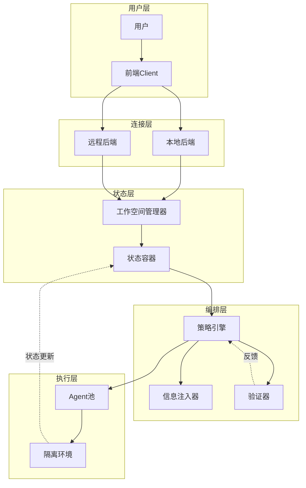
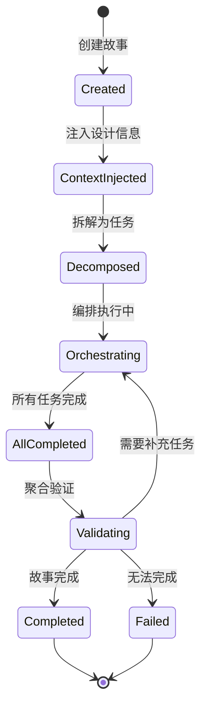
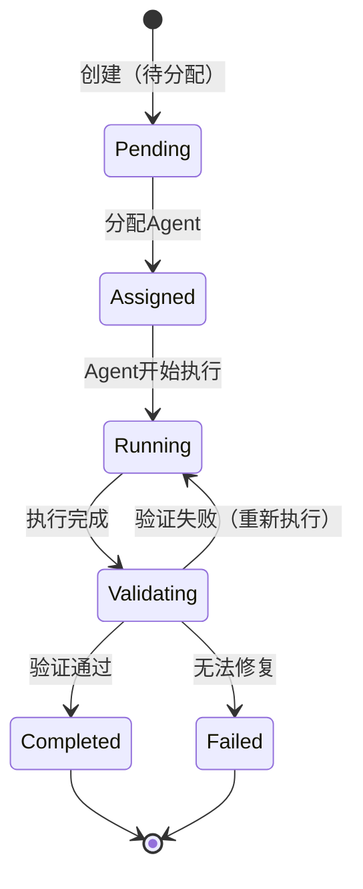
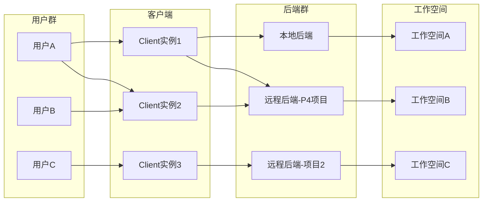
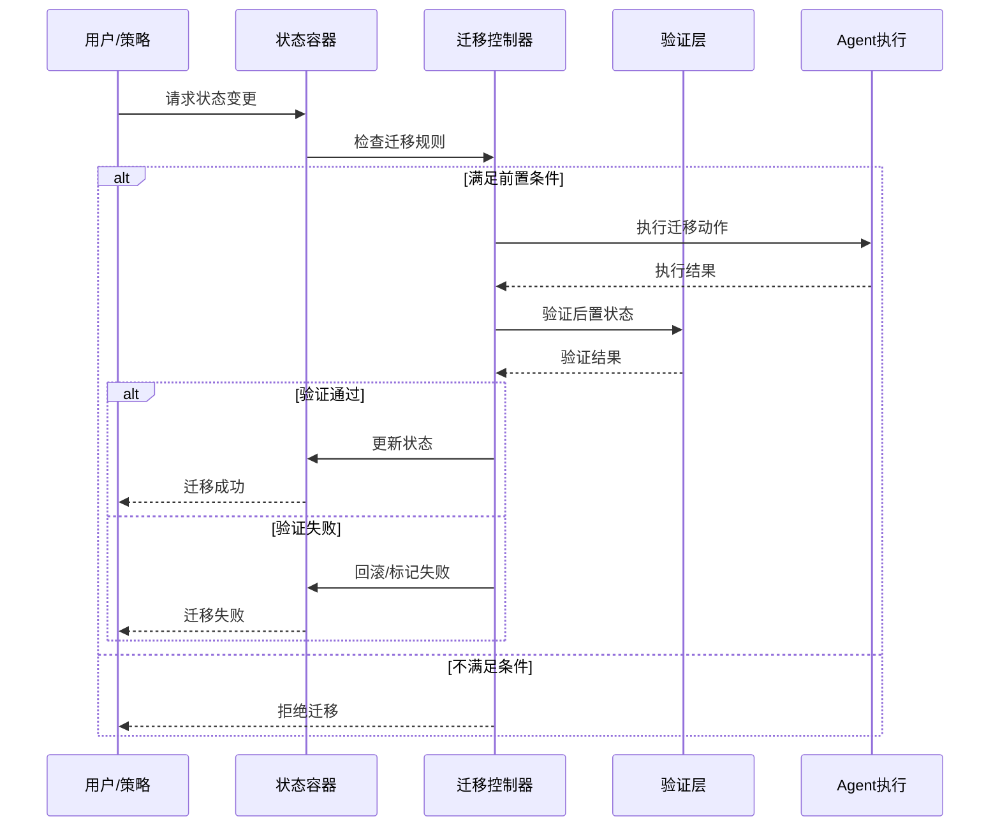
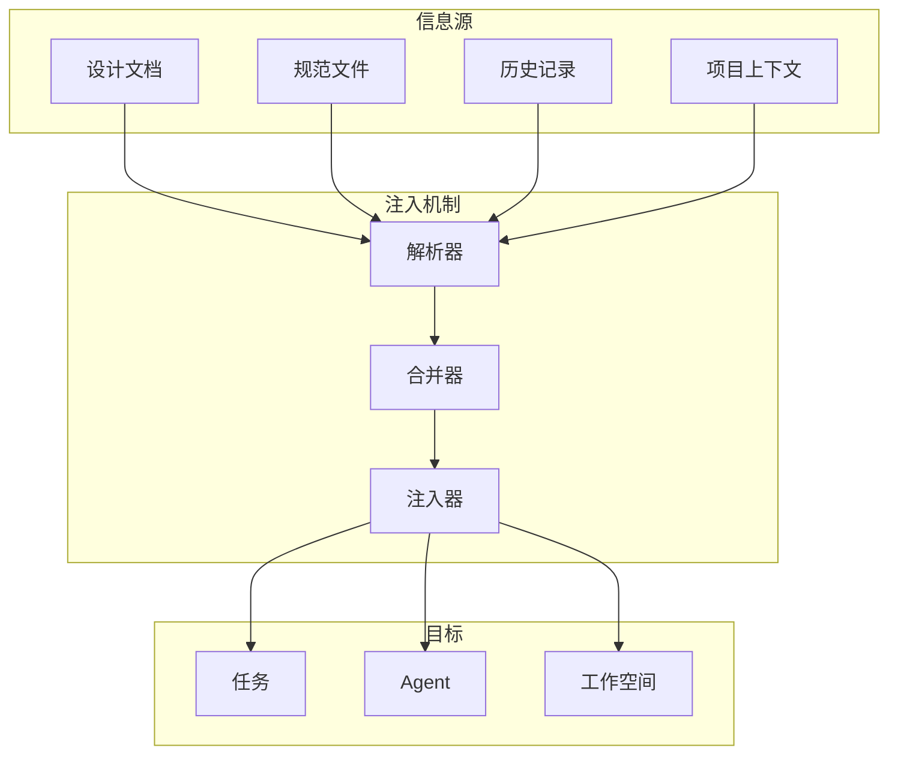
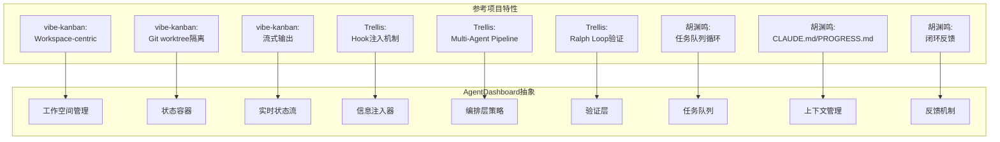
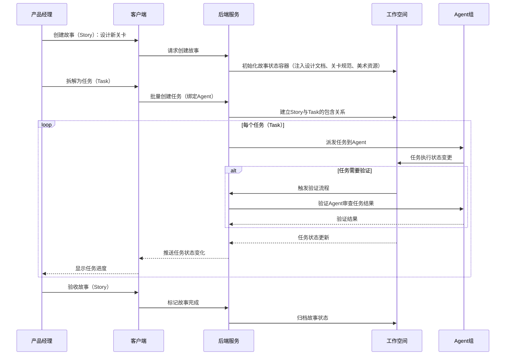

# AgentDashboard - 系统流程图

基于 vibe-kanban、Trellis 和胡渊鸣实践的分析，绘制的核心系统流程。

---

## 1. 整体架构流程

---

## 2. 工作项生命周期流程

### 2.1 故事（Story）生命周期

**故事职责：**
- 从用户角度描述需求
- 维护完整设计上下文
- 拆解和编排任务
- 聚合任务结果并验收
- 不直接执行，不绑定Agent

### 2.2 任务（Task）生命周期

**任务职责：**
- 一对一绑定Agent进程
- 在隔离环境中执行
- 捕获执行状态和产物
- 向所属故事报告结果

---

## 3. 多对多连接模型

---

## 4. 状态迁移控制流程

---

## 5. 标准化信息注入流程

---

## 6. 与参考项目的对比映射

---

## 7. 典型使用场景流程（游戏项目故事产出）

---

## 关键洞察总结

1. **状态容器** 是核心抽象，超越vibe-kanban的Workspace和Trellis的Task目录
2. **Story-Task双层模型** Story负责编排和验收，Task负责执行，职责清晰分离
3. **Story组织用户自定义** Story间关系是视图层概念，用户可按需编组，不影响执行
4. **验证层可插拔** 比Trellis的Ralph Loop更灵活，支持多种形式
5. **连接层透明化** 实现真正的多对多架构
6. **注入机制通用化** 不限于代码场景，支持任意数字生产

---

*版本：v0.1*  
*更新：2026-02-21 - 基于参考项目分析绘制*
